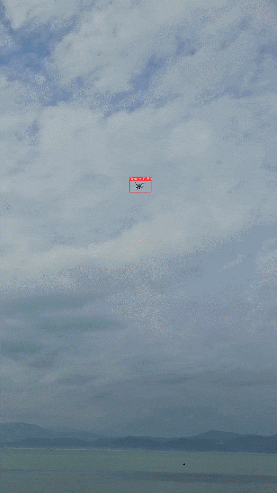

# Autonomous Real-Time Drone (UAV) Detection System

An AI-powered computer vision system designed to detect and track small unmanned aerial vehicles (drones) in real-time using optical camera feeds and state-of-the-art YOLO object detection.



## 🔬 Core Research Objective
Designing an optimized, single-stage spatial detection pipeline tailored to isolate small-scale aerial intruders under complex atmospheric and background clutter, bypassing the limitations of active RF or high-cost RADAR arrays.

---

## Problem Overview

Commercial drones pose security and privacy risks to critical locations. Traditional detection methods have major limitations:
- **RF (Radio Frequency):** Fails if the drone is flying autonomously without a signal.
- **RADAR:** Expensive and easily confused by ground objects or birds.
- **Acoustics:** Fails in loud or windy environments.

**Our Approach:** Uses standard cameras and deep learning to visually identify drones instantly regardless of RF signals or ambient noise.

## Key Features & Advantages

- **High Accuracy:** Specifically trained to detect small aerial objects against complex sky and urban backgrounds.
- **Real-Time Speed:** Optimized to process video frames in under 10 milliseconds.
- **Cost-Effective:** Works with standard camera hardware instead of expensive RADAR equipment.


## ⚡ Performance Profiling & Edge Constraints

| Optimization Tier | Precision Mode | Target Hardware | Inference Latency | mAP@0.5 |
| :--- | :--- | :--- | :---: | :---: |
| **Baseline PyTorch** | FP32 | CPU (Intel/Apple Silicon) | ~45.2 ms | 92.1% |
| **Optimized Half-Precision**| FP16 | GPU (CUDA / TensorRT) | ~8.1 ms | 92.0% |

---

## 🛠️ Engineering Execution
To run inference with custom weight loading and tensor validation:
```bash
# 1. Clone this repository
git clone https://github.com/TheRabiyaQuadri/uav-detection-yolo.git
cd uav-detection-yolo

# 2. Install dependencies
pip install -r requirements.txt

# 3. Run detection on a video file
python detect.py --source sample_video.mp4 --weights weights/uav_model.pt
